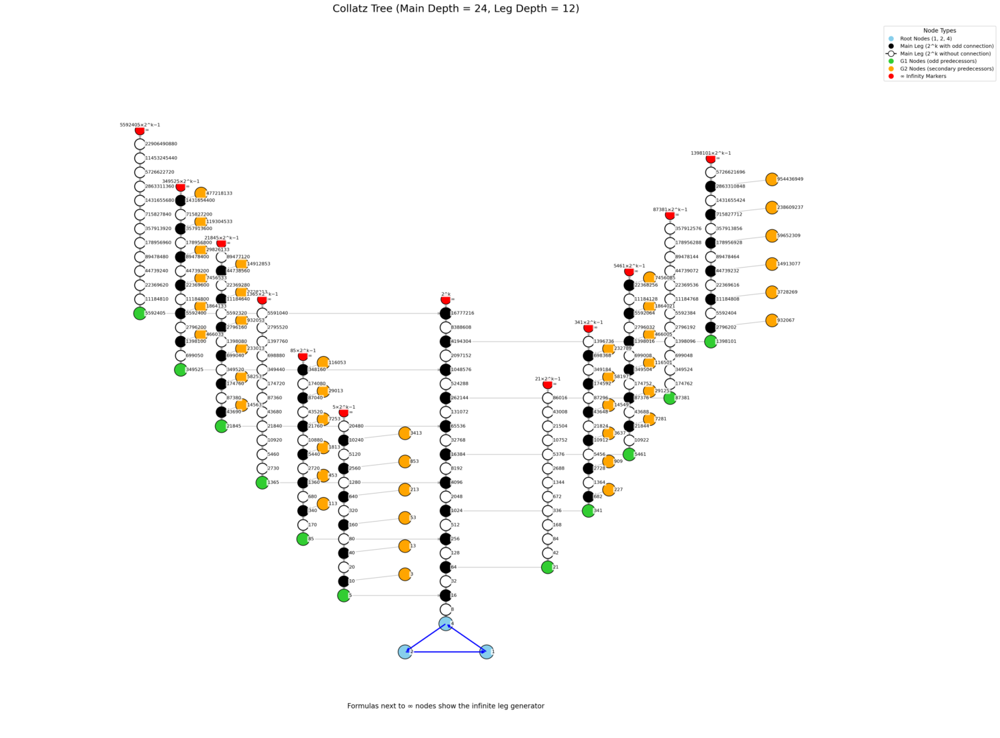

# 🌳 Collatz Tree Visualizer

An interactive visualization of the recursive Collatz Tree using the formula:

> n = (2^k · m - 1) / 3

## 📘 Overview

This app allows you to explore the **structural properties** of the Collatz Conjecture using a generational tree view. Built using **Streamlit**, it generates:

- Main vertical leg: powers of 2 (`2^k`)
- G1 branches: odd predecessors via `(2^k - 1)/3`
- G2 reverse connections using the formula above
- Infinity markers showing ongoing growth paths

---

## 🚀 How to Run

Clone the repo and install dependencies:

```bash
git clone https://github.com/your-username/collatz-visualizer.git
cd collatz-visualizer
pip install -r requirements.txt
streamlit run app.py


## 📸 Preview



---

## 📄 Reference

This app implements and visualizes the reverse Collatz logic discussed in the article:

**Ahmed Al-absi**  
["A New Perspective on Proving the Collatz Conjecture"](https://doi.org/10.5281/zenodo.15178879)  
DOI: `10.5281/ZENODO.15178879` – April 2025

---

## 💡 Developed With

- Python 3  
- Streamlit  
- NetworkX  
- Matplotlib


